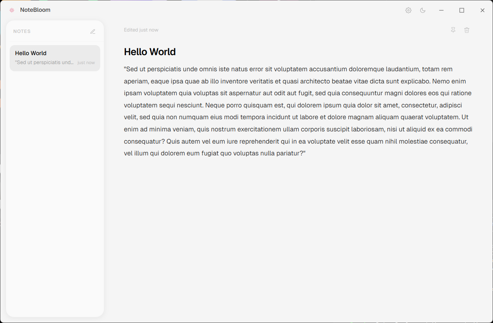
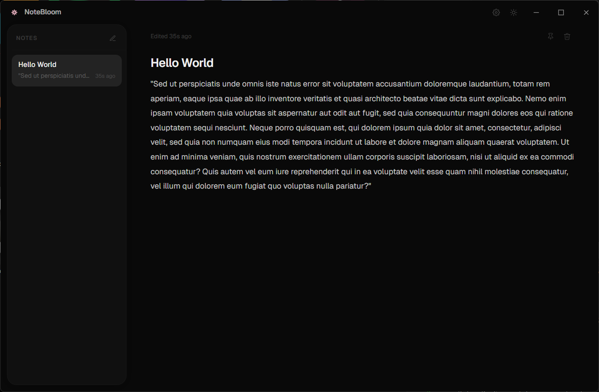

<div align="center">
  
  <h1>NoteBloom</h1>
  <p>A minimal, fast, local-first note-taking app — your thoughts, stored only on your machine.</p>

  [](https://tauri.app)
  [](https://react.dev)
  [](https://www.typescriptlang.org)
  [](https://www.rust-lang.org)
  [](LICENSE)
</div>

---

## Table of Contents

- [What it does](#what-it-does)
- [Screenshots](#screenshots)
- [Features](#features)
- [Download](#download)
- [Build from source](#build-from-source)
- [Architecture](#architecture)
- [Contributing](#contributing)
- [License](#license)

---

## What it does

NoteBloom is a frameless desktop notepad that gets out of your way. Notes are saved locally as JSON — no accounts, no sync, no tracking. Open it, write, close it. Your notes are always there.

---

## Screenshots

<div align="center">
  
  
</div>

---

## Features

- **Auto-save** — writes to disk 800 ms after you stop typing
- **Draft cache** — unsaved edits survive crashes and forced closes
- **Pin notes** — keep important notes anchored at the top of the list
- **Duplicate** — clone any note with one click
- **Save as** — export a note to a `.txt` file anywhere on your machine
- **Right-click menu** — context actions on every note, fully configurable
- **Settings panel** — toggle UI elements, spell check, and individual context menu items
- **Wipe all data** — single button to delete everything and reset to defaults
- **Dark / light theme** — follows system preference, persists across restarts
- **Keyboard shortcuts** — `Ctrl+N`, `Ctrl+S`, `Ctrl+P`, `Ctrl+Backspace`
- **Frameless window** — native window controls (Mac and Windows 11 style)
- **No telemetry, no network, no cloud** — 100% local

---

## Download

Pre-built installers are available on the [Releases](https://github.com/ChloeVPin/notebloom/releases) page.

| Platform | Architecture | Format |
|----------|-------------|--------|
| Windows | x64 (Intel / AMD) | `.msi` |
| Windows | ARM64 | `.msi` |

macOS and Linux installers are not yet published — see [Build from source](#build-from-source) to run on those platforms.

---

## Build from source

See **[BUILD.md](BUILD.md)** for full platform-specific instructions covering Windows, macOS, and Linux.

**Quick start (any platform):**

```bash
# 1. Install Rust (macOS / Linux)
curl --proto '=https' --tlsv1.2 -sSf https://sh.rustup.rs | sh
# Windows: https://rustup.rs

# 2. Install dependencies
npm install

# 3. Run in development
npm run tauri dev

# 4. Build a release installer
npm run tauri build
```

---

## Architecture

```
┌─────────────────────────────────────┐
│           React frontend            │
│  src/App.tsx · src/lib/notes.ts     │
│  Tailwind CSS v4 · shadcn/ui        │
└────────────────┬────────────────────┘
                 │  invoke() / IPC
┌────────────────▼────────────────────┐
│           Tauri v2 core             │
│  src-tauri/src/lib.rs               │
│  Commands: list, create, update,    │
│  delete, toggle_pin, duplicate,     │
│  get_settings, save_settings,       │
│  wipe_all_data                      │
└────────────────┬────────────────────┘
                 │  std::fs
┌────────────────▼────────────────────┐
│         Local JSON files            │
│  %APPDATA%/com.chloe.notebloom/     │  ← Windows
│  ~/Library/Application Support/…    │  ← macOS
│  ~/.local/share/…                   │  ← Linux
│    notes.json · settings.json       │
└─────────────────────────────────────┘
```

See [docs/architecture.md](docs/architecture.md) for a deeper breakdown.

---

## Contributing

Contributions are welcome. Please read [CONTRIBUTING.md](CONTRIBUTING.md) before opening a pull request.

Found a bug? [Open an issue](https://github.com/ChloeVPin/notebloom/issues).

---

## License

MIT — see [LICENSE](LICENSE).
